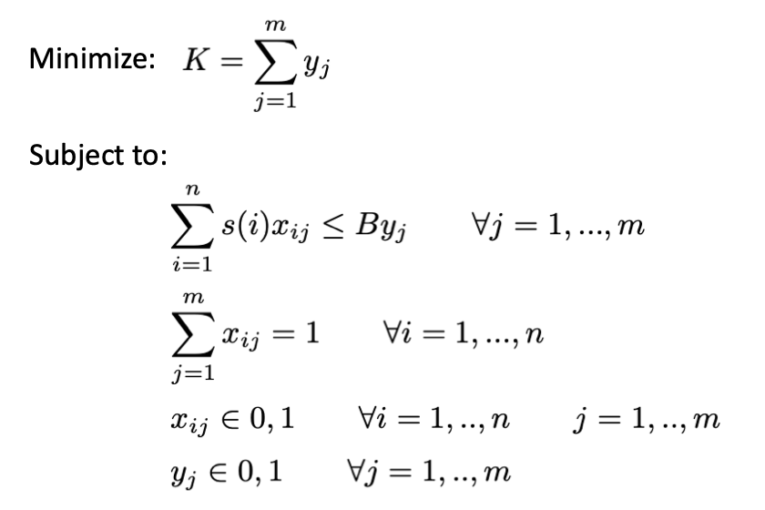
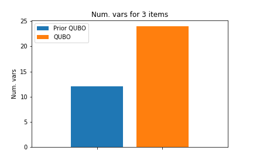

# Qiskit Hackathon Global

# NEW METHOD FOR INEQUALITY CONSTRAINED OPTIMIZATION PROBLEM

## The problem

Different optimization problems suited for being solved by quantum computers (QC) have inequality constraints that make a first approach of solving them really difficult for our current noise intermediate-scale quantum (NISQ) technology. This is because, the inequality constraints have to be converted into equality constraints and then, converted to binary representation and being solved with quadratic penalizations. The extra qubits added by these transformations and the resulting equation give us the motivation for looking at alternatives to get rid of the inequality constraints keeping the number of qubits constant. We will use the bin packing problem to test our alternative to the commonly used converter of the Qiskit library for inequality-constrained problems. For the solution, we use a variational quantum algorithm (VQA), the quantum approximate optimization algorithm (QAOA).

## Bin Packing Problem

The [bin packing problem](https://en.wikipedia.org/wiki/Bin_packing_problem) is an optimization problem where given a number of items with an assigned weight, we look at the best way to group the items minimizing the number of bins or containers needed to store them. The restriction, in this case, is the capacity of the bins which cannot surpass a certain weight. This problem has many real applications in areas as loading trucks with a weight restriction, filling up containers, and FPGA semiconductors chip design. 

In terms of complexity, the bin packing problem is an NP-hard problem. However, there are efficient algorithms that allow the arrangement of a large number of items. One of them is the first fit, which provides a fast but not optimal solution to the problem. 

For our problem, we will explore the solution of the bin packing problem, using a quantum computing representation in terms of quadratic unconstraint binary optimization (QUBO) and using the quantum approximation optimization (QAOA) algorithm. 

### Problem statement

- n is the number of items
- m is the number of bins
- s(i) is the i-th item weight
- B is the maximum weight of the bin
-  is the variable that represent if the item i is in the bin j.
-  is the variable that represent if bin j is used

## The solution

We look for a heuristic approach based on a new penalization that does not increase the number of qubits for the solution on a QC and still accomplishes the penalization when the sum of the weights on a bin surpasses the maximum weight allowed. In this notebook, we will go through:

1) Codification of the problem

2) The classical approach

3) Our new approach

4) Comparison between both approaches

5) Conclusions

## 1. Codification of the problem

To construct the model, we use the library docplex. Once we have the problem as a cplex model, we use the function QuadraticProgram from qiskit_optimization to translate the problem and finally the function QuadraticProgramToQubo to convert the problem into the quadratic unconstrained binary optimization (QUBO) representation.

For this initial set, we chose a small problem. Here, we select 3 items with a maximal weight of 15. The weight of the items is chosen randomly from values between 1 and the maximal weight. 

### Simplifications

From this point and through the document, we make some simplifications for the problem being easy to solve, the problem variables can be reduced using the following simplifications:

- Removing unnecesary decision variables, the minimum number of bins should be at least equal to the sum of the weights of the items. 

- We assign the first item into the first bin.  

Therefore, the number of variables after the simplifications and assuming m = n: 

meanwhile for the original number of variables is:

a reduction of n + l variables.
